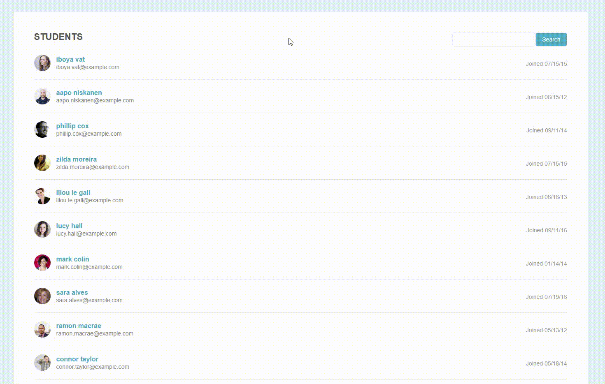

# Student List Pagination

This project uses JavaScript to dynamically paginate a long list of students and create a search bar to search through the list.

## Table of Contents
- [Showcase](#showcase)
- [Variables](#variables)
- [Functions](#functions)
- [Main Functions](#main-functions)
- [Getting Started](#getting-started)

## Showcase

## Variables

- `page`: selects the entire web page.
- `header`: selects the header section of the web page.
- `students`: selects all the `li` elements with the class name `"student-item"`.
- `paginationDiv`: selects the div element with the class name `"pagination"`.
- `errorH3`: creates an h3 element that is used for error messages.
- `studentsPerPage`: stores the maximum number of students per page.
- `foundStudents`: an empty array that stores the matching students when a search query is made.

## Functions

- `hideAllStudents()`: Hides all students on the page by setting their display property to "none".
- `removeOldPageLinkSection()`: Removes the existing pagination link section from the page if it exists.
- `createPageLinkSection()`: Creates the pagination section with the necessary amount of links depending on the number of students per page.
- `addListeners()`: Adds listeners to all anchor elements in the pagination div.
- `createSearchSection()`: Creates a search bar section in the header.
- `createErrorMessage()`: Creates an error message to display when searches yield no matches.
- `hideErrorMessage()`: Hides the error message.
- `showErrorMessage()`: Displays the error message.

## Main Functions

- `showPage(pageNum, list)`: Shows the proper number of students on the page depending on the page number clicked.
- `appendPageLinks(list)`: Appends the pagination div to the page and adds listeners to each anchor.
- `searchList()`: Appends the search list to the page, grabs user input, and displays matched students to the page.

## Getting Started

1. Open `index.html` in your web browser to view the student list and pagination.
2. To search through the list, type a name or email address into the search bar and click the search button.
3. If no matching students are found, an error message will be displayed.
4. To navigate through the pages of students, click on the page numbers at the bottom of the page.
